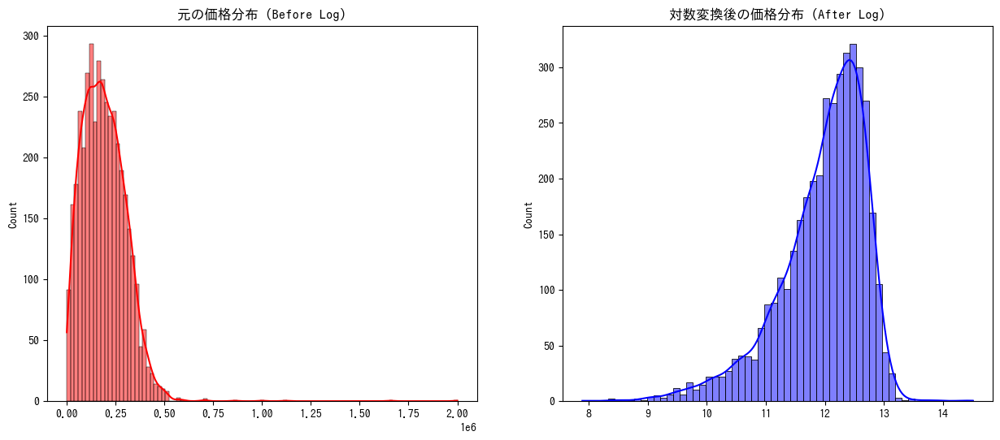
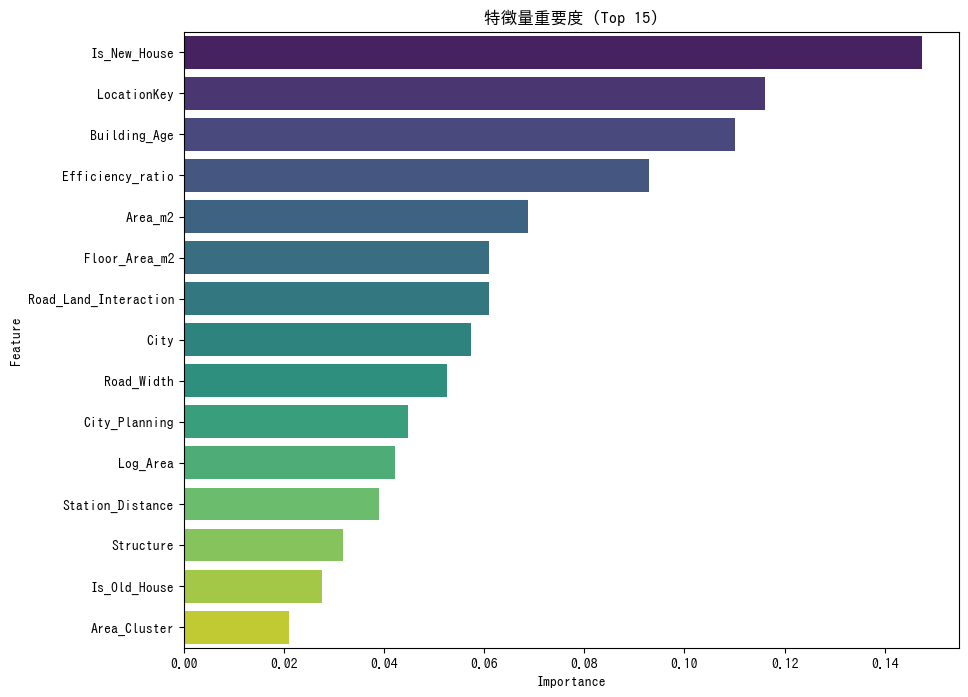

#AI-model-for-Mikawa-real-estate-valuation

愛知県三河地域（岡崎、豊田、安城など）の国土交通省不動産取引データを活用し、価格予測を行うスタッキングアンサンブルモデルです。

### 🎯 プロジェクトの目的
三河地域は製造業の中心地であり、名古屋市とは異なる独自の不動産市場を持っています。本プロジェクトの目的は以下の通りです：

1. **価格の透明化**: 投資家や居住者が、市場平均に基づいた適正価格を即座に判断できる指標を提供。
2. **意思決定の支援**: 築年数や駅からの距離が、具体的にいくらの価値に影響するかを可視化。

### 📊 モデル性能
実データ（2015年〜2025年）を用いた検証結果：
* **決定係数 (R2 Score)**: `0.7095`
* **平均絶対誤差 (MAE)**: `35,017 円 / ㎡`

---

--技術的な工夫--
精度向上（0.60 → 0.71）のために導入した高度な手法：

###1.㎡単価

 ---総額ではなく「㎡単価」を予測対象に設定。面積によるバイアスを排除し、土地・立地の純粋な価値を学習させました。
 
###2.経済圏クラスタリング (K-Means Clustering)

 ---「最寄駅からの距離」と「㎡単価」に基づき、エリアを6つの経済圏（クラスター）に分類。単なる行政区画（市町村）の枠を超え、駅近の高価格帯エリアや郊外の低価格帯エリアなど、市場の実態に即した地域特性をモデルに反映させました。
 
###3. スタッキング・アンサンブル (Stacking Ensemble)

 ---3つの強力なGBDTモデルを組み合わせ、最終予測をRidge回帰で統合することで、単一モデルよりも汎化性能を高めました。
    XGBoost / LightGBM / CatBoostの統合。

 ---
 
--データ可視化--

##価格分布の正規化 (Log Transformation)
価格データの偏りを抑え、学習効率を最大化するために対数変換を実施。

##特徴量の重要度 (Feature Importance)
AIがどの要素（面積、築年数、駅距離など）を重視して価格を決定したかを可視化。

---\

📦 モデルの再構築
モデルのファイルサイズが大きいため（>50MB）、3つのパーツに分割して保存しています。ローカル環境で実行する前に、以下のコマンドでファイルを結合してください。

Linux / macOS / Git Bash:
cat models/model_part_a* > models/mikawa_stacking_model.joblib

Windows (Command Prompt):
copy /b models\model_part_aa + models\model_part_ab + models\model_part_ac models\mikawa_stacking_model.joblib

--使い方--

1. pip install -r requirements.txt
2. streamlit run stream_web_property.py
